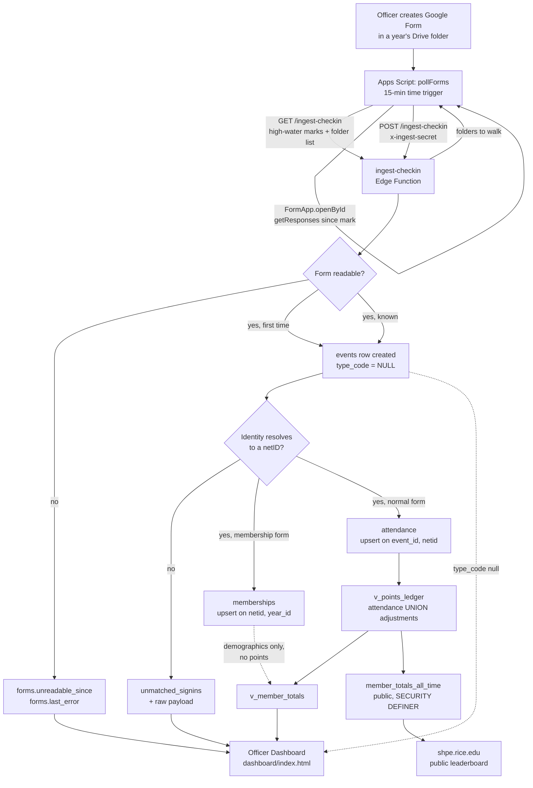

# SHPE Points — How It Works

**Purpose of this document.** [`DESIGN.md`](DESIGN.md) argues *why* each decision was made.
[`RUNBOOK.md`](RUNBOOK.md) tells a non-technical VP what to click on Tuesday. Neither one lets
you trace a single form response from a member's tap to the public leaderboard. This document
does that: it is the mechanism reference for a technically-inclined person maintaining or
debugging this system. It assumes some SQL and JavaScript, nothing about this codebase.

Facts below marked "live" were checked directly against Supabase project `jzxxchjjhkbvfazrbeom`
on 2026-08-09. Everything else is read from the code, cited by path.

---

## 1. The system in one paragraph

An officer creates a Google Form in a Drive folder that belongs to an academic year. A single
Apps Script trigger, running every 15 minutes under the club's shared Gmail, discovers the form,
reads its responses directly from the Form object (never a linked spreadsheet), and POSTs them to
one Supabase Edge Function. That function is the only door attendance data goes through: it
resolves each response to a netID, creates an `events` row the first time it sees a form, and
writes `attendance` rows at 0 points if nobody has told it what kind of event this is yet.
Everything downstream is derived, not stored as a running total — two Postgres views sum the
ledger on every read, one for officers (`v_member_totals`) and one, deliberately narrower, for
the public (`member_totals_all_time`). The one thing the system asks a human for is the event's
type; tapping it in the dashboard retroactively prices every attendance row already recorded.
Nothing else requires attention.

---

## 2. Data model

All objects live in `public`, applied by the migrations in `supabase/migrations/`, in
chronological order. Legacy tables were moved to a `legacy` schema and are not queried by
anything live (`supabase/migrations/20260731024821_move_legacy_to_legacy_schema.sql`).

| Table / view | What it's for |
|---|---|
| `people` | Permanent identity. Never deleted. `netid` is the primary key, checked lowercase and non-empty. |
| `academic_years` | One row per year (`'2025-26'`). Carries `starts_on`, `ends_on`, and `forms_folder_id` — the Drive folder the poller watches for that year. |
| `memberships` | The per-year opt-in. Demographics (`class_level`, `major`, `gender`, `expected_grad_year`, `college`, `birthday`) live here, not on `people`, because a member's major in the 2027 deliberation should be the 2027 form's answer. `unique (netid, year_id)`. |
| `roles` | Who held `eboard` or `chair` in a given year. `primary key (netid, year_id, role)` — someone who studies abroad can hold one role each half of a year and both rows are kept. |
| `role_bonus_config` | Configurable bonus point values per year/role, not hardcoded. `primary key (year_id, role)`. |
| `event_types` | The six types: `gbm`, `career`, `social`, `company`, `volunteer`, `membership`. Carries `default_points`, `is_variable_points` (true only for `volunteer`), `is_membership_form` (true only for `membership`). |
| `forms` | One row per discovered Google Form. `event_id` is **nullable** — see below. `last_response_at` is the polling high-water mark. `unreadable_since`/`last_error`/`title` surface a form the poller can't open. |
| `events` | One row per event, auto-created on first form discovery or created manually for volunteering. `type_code` is **nullable** — see below. `points` defaults from the type but can be overridden per event. `source` is `'form'`, `'manual'`, or `'backfill'`. |
| `attendance` | The immutable ledger. One row per person per event. `points_awarded` is a **stored snapshot**, not computed at read time — see §3. `unique (event_id, netid)`. |
| `adjustments` | Role bonuses and manual corrections, both visible and auditable line items rather than a computed column. `kind` is `'role_bonus'` or `'manual'`; `reason` is required. Carries `effective_on` — see below. |
| `unmatched_signins` | Anything that couldn't resolve to a netID, or a membership response with no academic year to land in. Never silently dropped. |
| `officers` | The dashboard access allowlist, keyed on email. |
| `app_config` | Two rows, live: `leaderboard_window_start` (`''`, meaning all-time) and `current_year_id` (`'2026-27'`). |
| `v_points_ledger` | View. `attendance ∪ adjustments` as one stream of `(netid, occurred_on, points, kind, label)` rows — the single definition of "a point" everything else aggregates. |
| `v_member_totals` | View. The ledger aggregated per person, joined to *this year's* membership row for slicing by major/gender/class. Officer-only. |
| `member_totals_all_time` | View. Public. `rank, first_name, last_name, total_points` only. |

### Non-obvious columns

**`events.type_code` is nullable.** It means "awaiting the officer's one tap." A newly discovered
form creates an event with `type_code = NULL` and attendance still ingests, at 0 points
(`supabase/functions/ingest-checkin/index.ts:174-186`). This is what lets ingestion never block on
a human.

**`events.ignored_at` / `ignored_by` mark a discovered form that was never an event.** Added
2026-08-09 (`supabase/migrations/20260809221613_events_ignored.sql`). The poller walks a whole Drive
folder, so it also finds forms that aren't sign-ins — an officer application, a t-shirt survey. The
dashboard's **Not an event** button sets these two columns, deletes the event's (0-point) attendance
and unmatched rows, and the event drops out of Needs attention. The Edge Function then reads and
discards that form's responses on every later pass while still advancing its high-water mark, so a
dismissed survey costs one near-empty `getResponses()` call rather than a full re-download forever.

**The event row is deliberately kept, not deleted — and this is load-bearing.** `forms.event_id` is
`ON DELETE CASCADE`, so deleting an ignored event would also delete the `forms` row that records the
form as already discovered. The next poll would find the form, see no `forms` row, and create a
brand-new untyped event for it. Deleting an ignored event doesn't dismiss it, it resets it, on every
pass, forever. A future editor "cleaning up" tombstoned rows would reintroduce exactly that loop.

**`attendance.points_awarded` is a stored snapshot, not computed at read time.** Two reasons
(`docs/DESIGN.md`, principle 3): volunteering needs it — two people at one event can log different
hours and therefore different points — and it stops next year's point-value change from silently
rewriting last year's history. See §3 for the trigger that reconciles this with "tapping a type
pays retroactively."

**`adjustments.effective_on` exists** because `app_config.leaderboard_window_start` is a *date*
filter applied to `v_points_ledger.occurred_on`. A role-bonus row carrying only a `year_id` has no
date to filter on, so it would leak past any window an officer sets — `effective_on` defaults to
the academic year's start date (`supabase/migrations/20260731024857_new_schema.sql:115-118`).

**`forms.event_id` is nullable.** A form the poller can't open (wrong Drive permissions) has no
readable responses, so the system knows neither its date nor its attendees — there is nothing to
create an event *from* yet. This was **not** the original design: the first schema migration made
`forms.event_id` `NOT NULL`, which meant the unreadable-form write path could never insert its row
at all (the insert failed, the error was discarded, and the single most likely way an officer
breaks ingestion — building a form under a personal account — was invisible on Needs attention).
Fixed in `supabase/migrations/20260803001228_forms_allow_unreadable_before_event.sql`, which also
adds `forms.title` so Needs attention can name the broken form instead of showing a bare Drive
file ID.

### Unique constraints worth knowing

- `attendance unique (event_id, netid)` — one attendance row per person per event; the mechanism
  behind sign-in dedup.
- `memberships unique (netid, year_id)` — one membership row per person per year; upserted, not
  insert-or-ignore, because a resubmission should replace stale demographics.
- `adjustments_one_role_bonus_per_person_year` — a **partial** unique index,
  `on (netid, year_id) where kind = 'role_bonus'`
  (`supabase/migrations/20260731024857_new_schema.sql:130-131`). Partial because a person can also
  hold unrelated `'manual'` adjustment rows in the same year that must not collide with this
  constraint. This is also why `apply_role_bonuses` cannot be a plain PostgREST upsert — PostgREST's
  `on_conflict` only emits a column list, which Postgres can't match against a partial index
  (`supabase/migrations/20260731025006_officer_rpcs.sql:12-15`).

---

## 3. How points are actually computed

Two layers, and they get confused for each other constantly:

**(a) Write-time stamping**, by three triggers in
`supabase/migrations/20260731024951_event_point_sync.sql`:

- `events_default_points` (BEFORE INSERT/UPDATE on `events`) — when a type is set and no explicit
  `points` override is given, copies `event_types.default_points` onto the event row.
- `events_restamp_attendance` (AFTER UPDATE on `events`, when `points` or `type_code` actually
  changed) — this is the retroactive-award mechanism. It walks every `attendance` row for that
  event and overwrites `points_awarded` with the event's new value (or, for a variable-points type
  like `volunteer`, with that row's own `hours`). This is the trigger that reconciles "points are a
  snapshot" with "tapping a type later pays everyone already recorded."
- `attendance_hours_to_points` (BEFORE INSERT/UPDATE of `hours` on `attendance`) — for volunteering,
  `points_awarded` is just set equal to `hours` whenever hours changes.

A fourth trigger, added 2026-08-09 in
`supabase/migrations/20260809212826_membership_retype_replays.sql`, handles the one case the three
above cannot:

- `events_membership_retype_replays` (AFTER UPDATE OF `type_code` on `events`) — fires only on the
  transition *into* a membership type from a non-membership type or from NULL. It deletes that
  event's `attendance` rows and sets `forms.last_response_at` back to NULL.

  **Why deleting is the correct move here.** Restamping cannot fix a membership form tapped late,
  because the responses were never written to `memberships` in the first place — the Edge Function
  routes to `memberships` only if the event is *already* typed membership at ingest time
  (`supabase/functions/ingest-checkin/index.ts:214-240`), and a form is discovered *by* ingest. So
  the realistic sequence is: form discovered → responses land in `attendance` at 0 points → officer
  taps Membership. By then the high-water mark has advanced past those responses and the poller
  would never re-send them. Nulling the mark makes the next pass re-request the form's full history
  (`apps-script/poller.js:193`), which now routes correctly. The delete and the reset must happen
  together: reset alone duplicates, delete alone is the permanent loss this trigger exists to
  prevent.

  **The guard that makes the delete safe.** It only fires when a `forms` row exists for the event.
  An event with no form has no replay source — nothing would ever re-send its attendance. This
  matters because `source='manual'` events can sit untyped in Needs attention (the dashboard renders
  a "manual" pill for exactly that state), so an officer could tap Membership on one by mistake.
  Without the guard, that mis-tap would silently destroy every attendance row on the event with no
  way to recover it.

**(b) Read-time aggregation**, by the views. `v_points_ledger`, `v_member_totals`, and
`member_totals_all_time` are **plain views**, not materialized — every query re-sums
`attendance ∪ adjustments` live. There is no stored running total anywhere; "recompute" is not an
operation, it's just what a SELECT does.

**Why `events_restamp_attendance` does not react to `event_types.default_points` changes.** The
trigger only fires on `events.points` or `events.type_code` changing — never on an edit to
`event_types`. So if next year officers decide `career` events are worth 3 points instead of 2,
every `career` event recorded *this* year keeps paying 2, because its `events.points` value was
already stamped and nothing touches it. Re-pricing a category going forward cannot silently rewrite
history. (`supabase/migrations/20260731024951_event_point_sync.sql:14-16`)

**How "points reset" actually works.** There is no reset operation and no cron job. Both
`v_member_totals` and `member_totals_all_time` read `app_config.leaderboard_window_start` inline,
in a correlated subquery, and filter `occurred_on >= that date` when it's non-empty
(`supabase/migrations/20260731025444_harden_views_and_functions.sql:37-42`). Live, that value is
`''`, meaning no filter — all-time accumulation. Changing the reset policy later is one `UPDATE` on
one `app_config` row; no migration, no code change, reversible. There is currently **no dashboard
control** for this row — see §10.

---

## 4. Identity resolution

Two independent modules exist for two different jobs, and they intentionally use opposite
strategies.

### `_shared/netid.ts` — who is this person? (fuzzy, on purpose)

Officers write their own forms with no fixed question wording, so the resolver can't assume a
question exists. Resolution order (`supabase/functions/_shared/netid.ts:60-79`):

1. **Question-title match first.** Any answer to a question whose title matches
   `/net\s*id|netid|rice\s*email|email/i`.
2. **NetID-shape fallback second.** If no question title matched, any answer that simply looks
   like a netID or a Rice address.
3. Both paths run the answer through `normalizeNetid`: lowercase, trim, strip zero-width/non-breaking
   space artifacts from pastes, strip `mailto:`, and if there's an `@`, **require the domain to be
   exactly `rice.edu`** — anything else returns `null` rather than the local part.
4. Unresolvable → the caller writes an `unmatched_signins` row with the raw payload attached.
   Never silently dropped, never invented.

**The deliberate refusal:** a personal Gmail's local part is never treated as a netID, even though
it's syntactically shaped like one. Guessing would invent a phantom person who then accumulates
real points under a spelling of a name that isn't a Rice identity. (Three legacy identities *are*
personal-email local parts, preserved from the old spreadsheets — see §10. Live re-submission by
those three people will not re-match; they land in `unmatched_signins` for a one-click officer
fix, which is the intended behavior, not a bug.)

### `_shared/membership-template.ts` — what's this person's major? (exact, on purpose)

Opposite strategy, for the opposite reason. A wrong netID guess is cheap: it gets caught by the
`unique (event_id, netid)` constraint or a foreign key failure, and worst case lands in
`unmatched_signins` for a human to fix. **There is no equivalent safety net for a guessed major or
gender** — a silently wrong demographic value corrupts the exact number the October deliberation
grid is built from, with nothing downstream that would ever catch it.

So `extractMembershipDemographics` matches question titles **verbatim, case-sensitive, no
substring, no regex** (`supabase/functions/_shared/membership-template.ts:76-104`). The six
required question titles:

| Question title | Column | Must be |
|---|---|---|
| `Class Level` | `class_level` | short answer |
| `Major` | `major` | short answer |
| `Gender` | `gender` | short answer or multiple choice |
| `Expected Graduation Year` | `expected_grad_year` | exactly 4 digits, or the answer is dropped |
| `College` | `college` | short answer or multiple choice |
| `Birthday` | `birthday` | a Google Forms **Date** item — anything not shaped `yyyy-mm-dd` is dropped |

A question titled anything else — including `"What's your major?"` or lowercase `"major"` —
contributes nothing for that response; the column stays `NULL`, visible and honest on the Roster
tab, rather than inventing a value. Widening this map is only ever done by adding a new literal
string after confirming the template actually uses it — never by loosening the comparison.

---

## 5. The five idempotency layers

The poller can safely re-send after any failure — network drop, Edge Function error, Apps Script
timeout — because nothing downstream assumes it's seeing a request for the first time.

1. **`unique (event_id, netid)` on `attendance`, upserted with `ignoreDuplicates`.** Replaying a
   pass with the same responses inserts nothing new
   (`supabase/functions/ingest-checkin/index.ts:326-336`, `onConflict: 'event_id,netid'`).
2. **`memberships` upserted on `(netid, year_id)` WITHOUT `ignoreDuplicates`.** This asymmetry with
   (1) is deliberate: `attendance` is an immutable ledger where the first row should win, but a
   membership row represents a person's *current* declared demographics, so a resubmission
   correcting a typo should overwrite it (`supabase/functions/ingest-checkin/index.ts:338-355`).
3. **In-batch dedup via a `Map` keyed on `netid|year_id`, before the upsert call.** Postgres
   rejects an `ON CONFLICT DO UPDATE` that would touch the same row twice within one statement, so
   two membership responses from the same person in one poll pass (a same-session correction) have
   to be collapsed client-side first, keeping only the latest by `submittedAt`
   (`supabase/functions/ingest-checkin/index.ts:244-249, 292-297`).
4. **The high-water mark (`forms.last_response_at`) advances only after every write in that form's
   batch succeeds.** If the function throws partway through, the mark stays put and the next pass
   re-sends the same responses — safe precisely because (1)-(3) make replay a no-op
   (`supabase/functions/ingest-checkin/index.ts:361-367`).
5. **`forms.form_id` is read before any write** (`select ... eq('form_id', form.formId).maybeSingle()`
   at `supabase/functions/ingest-checkin/index.ts:127-131`), specifically so the unreadable-form
   path can `UPDATE` an existing row instead of upserting one that omits `event_id` — an upsert
   there could null out the link between a form and the event it already created, and the next
   readable pass would create a *second* event for the same form.

Together: a poller pass that fails at any point can simply run again from scratch with no manual
cleanup, and a healthy pass that runs twice (e.g., a retried HTTP request) writes the same rows.

---

## 6. Failure modes and where each one surfaces

| Failure | Where it lands | Surfaces in dashboard as |
|---|---|---|
| Form unreadable (created under a personal account, not shared-Gmail-editable) | `forms.unreadable_since`, `forms.last_error`, `forms.title` | Needs attention → "Forms the poller cannot read" |
| Identity doesn't resolve to a netID | `unmatched_signins` row + full raw payload | Needs attention → "Unmatched sign-ins" |
| Event has no type yet | `events.type_code is null` | Needs attention → "Events awaiting a type" |
| Membership response with no academic year covering its date | `unmatched_signins` (both live ingest and `resolve_unmatched_signin` refuse to write a membership row with no `year_id`) | Needs attention → "Unmatched sign-ins" |

**The gap worth knowing.** Several failure classes never reach Postgres at all and are visible
**only** in Apps Script → Executions, on the account that installed the trigger:

- **Folder-open failures** — a bad or deleted Drive folder ID for one year — are caught and
  `Logger.log`'d, never thrown, so one broken year's folder doesn't stop polling for every other
  year (`apps-script/poller.js:127-140`).
- **Time-budget skips** — Apps Script kills a run at ~6 minutes; the poller stops at a 4-minute
  budget and logs how many folders/files it didn't reach (`apps-script/poller.js:45-46, 122-125,
  162-167`). Nothing is lost — the next pass picks up whatever wasn't reached — but there's no
  persisted record that a given pass was incomplete.
- **Per-form errors embedded inside an overall HTTP 200 response.** `ingest-checkin`'s POST handler
  returns `200` with a `forms: [...]` summary array even when individual entries in that array carry
  `status: 'error'` (e.g. `supabase/functions/ingest-checkin/index.ts:183-186, 331-335`). The
  poller's `push_()` only checks the top-level response code
  (`apps-script/poller.js:277-283`) and logs the full response text — it never parses the array for
  per-form failures. A single form silently failing to write its attendance rows, inside an
  otherwise-successful pass, is visible only by reading the raw logged JSON in Executions.
- **A form is deleted or moved out of its watched Drive folder.** The next pass's
  `folder.getFilesByType(...)` walk (`apps-script/poller.js:157`) simply never sees it again — there
  is no delete path anywhere in this system (`supabase/functions/`, `apps-script/`, and `scripts/`
  all have zero statements that delete attendance or form rows), so every point already recorded
  from that form is permanent and safe. But nothing marks it missing either: unlike the other three
  gaps above, this one leaves no trace even in Apps Script → Executions — no log line, no skip
  counter, nothing. The only symptom is that a form's per-pass response count quietly stops growing,
  indistinguishable from the form simply having no new sign-ins.

None of these four are persisted to a table an officer would ever look at. If ingestion looks
wrong for one specific form but Needs attention shows nothing, this is where to look next.

---

## 7. Security model

**RLS is enabled on all 13 base tables**, verified live. Every officer-facing policy is the same
shape: `for all to authenticated using (is_officer()) with check (is_officer())`
(`supabase/migrations/20260731024941_views_rls_and_public_cutover.sql:137-151`). `anon` has no
policy and no grant on any base table — two independent reasons it's shut out.

**`is_officer()` is `SECURITY DEFINER`.** A policy on `officers` that queries `officers` to check
who's an officer recurses infinitely; routing the check through a definer-rights function breaks
the cycle. Its `search_path` is pinned to `public` so a caller can't redirect the function body at
a shadowed table (`supabase/migrations/20260731024941_views_rls_and_public_cutover.sql:19-25`,
pinned in `20260731025444`).

**`v_member_totals` and `v_points_ledger` MUST stay `security_invoker = true`.** Verified live
(`reloptions: ["security_invoker=true"]` on both). This was a real vulnerability, not a
hypothetical: both views were originally created as ordinary views — which in Postgres means
`SECURITY DEFINER` — and granted to `authenticated`. A non-invoker view reads its base tables with
the *owner's* rights, bypassing RLS entirely, so any signed-in Google account (not just an
allowlisted officer) could have read every member's netID, gender, major, and points straight
through the two views the dashboard itself uses. Fixed in
`supabase/migrations/20260731025444_harden_views_and_functions.sql:15-16`; confirmed after the fix
that a signed-in non-officer sees 0 rows from `v_member_totals`, `people`, and `attendance`, while
an allowlisted officer sees the full 302/302/840.

**`member_totals_all_time` MUST stay `SECURITY DEFINER`** — verified live (`reloptions: null`,
i.e., default owner-rights behavior, confirmed distinct from the other two views). This is the
*only* reason `anon` can read totals while having zero access to `people` or `attendance`: the view
reads its base tables with the view owner's (`postgres`) rights, so RLS never has to be granted to
`anon` at all. Because of this, `member_totals_all_time` cannot be built on top of
`v_member_totals` (that view now applies RLS and would return 0 rows to `anon`) — it re-derives the
ledger from `attendance`/`adjustments`/`people` directly
(`supabase/migrations/20260731025444_harden_views_and_functions.sql:28-50`). **The Supabase
security linter flags this view as an ERROR.** That is expected and must not be "fixed" — adding
`security_invoker` here silently breaks the public leaderboard on shpe.rice.edu.

**The Edge Function uses the `service_role` key**, never the anon key, and is deployed with
`verify_jwt` off (auth is instead the `x-ingest-secret` header, constant-time compared —
`supabase/functions/ingest-checkin/index.ts:56-73`). It bypasses RLS by design (it's the only thing
besides a migration that writes `attendance`) and is never exposed to a browser — the poller calls
it from Apps Script's server-side `UrlFetchApp`, not from any client-side JS.

---

## 8. Load-bearing invariants

Things a future editor could change without realizing they'd break something. Each verified
against the live schema on 2026-08-09.

| Invariant | Why | Verified |
|---|---|---|
| `member_totals_all_time` keeps its name and its `first_name, last_name, total_points` columns | shpe.rice.edu's live leaderboard page queries this view by name for exactly these fields (`docs/API.md`). Renaming or dropping a column silently breaks a page this repo doesn't control. | View exists live with these columns plus `rank`. |
| `member_totals_all_time` stays `SECURITY DEFINER` | The only mechanism letting `anon` read totals with zero grants on any base table. | `reloptions: null` (definer, not invoker) confirmed live. |
| `v_member_totals` / `v_points_ledger` stay `security_invoker = true` | Without it, RLS is bypassed for any signed-in Google account, not just officers. | `reloptions: ["security_invoker=true"]` confirmed live on both. |
| `events_restamp_attendance` never fires on `event_types.default_points` changes | Re-pricing a category next year must not rewrite last year's history. | Trigger definition only watches `events.points`/`events.type_code` (`20260731024951`). |
| `adjustments_one_role_bonus_per_person_year` stays a **partial** unique index, not a plain one | `apply_role_bonuses` idempotency and the coexistence of role-bonus and manual adjustment rows for the same person/year both depend on the `where kind = 'role_bonus'` clause. | Confirmed in `20260731024857_new_schema.sql:130-131`. |
| `attendance.points_awarded` is never derived at read time | Volunteering needs per-person variance; point-value history must be immutable. | Confirmed: no view recomputes it from `event_types`; triggers stamp it on write. |
| The Edge Function stays keyed by `x-ingest-secret`, not JWT | It's called by server-side Apps Script, not a signed-in browser; `verify_jwt` is intentionally off. | Confirmed live: 1 deployed function, `verify_jwt` off (per task-provided facts). |

---

## 9. Operations

**Where every secret lives:**

| Secret | Lives in |
|---|---|
| `INGEST_SHARED_SECRET` | Supabase → Edge Functions → `ingest-checkin` → Secrets |
| `INGEST_URL`, `INGEST_SECRET` | Apps Script project → Project Settings → Script Properties (the poller's only two config values — no folder ID, see below) |
| Supabase anon key | Hardcoded in plaintext in `dashboard/index.html:279` |

**Why the anon key in plaintext is safe.** It is safe *only* because RLS is correct: `anon` has no
grant on any base table and no policy anywhere, so the anon key can do exactly one thing —
`SELECT` from `member_totals_all_time`, which exposes name and total points and nothing else. The
key being public is the same trust model as the existing shpe.rice.edu leaderboard page, which
already embeds it. If this invariant (§8) is ever broken, the anon key stops being safe to publish
immediately.

**What to check first when nothing has ingested in days:** sign in as the shared Gmail →
script.google.com → open the poller project → **Executions**. Per §6, folder-open failures,
time-budget skips, and per-form errors are visible *only* here, not in any table. The most common
real-world cause named in `RUNBOOK.md` is an expired Apps Script authorization after a Google
account change, fixed by re-running `installTrigger` (it deletes every existing `pollForms` trigger
before installing one, per `apps-script/poller.js:68-74`, so re-running is always safe).

**Rolling the academic year.** This is a dashboard action, not a code change — the entire point of
"the no-manual-changes rule" in `DESIGN.md`. An officer clicks the gear on the year switcher pill
(`dashboard/index.html`, the `openYearDialog`/`wireYearDialog` functions around line 1131-1191) or
"Start a new academic year," which calls the `create_academic_year` RPC
(`supabase/migrations/20260802195206_year_lifecycle_and_membership.sql:46-116`). That function:
creates the `academic_years` row, copies `role_bonus_config` forward from the prior year (or seeds
eboard=5/chair=3 if there is no prior year), and optionally flips `app_config.current_year_id`. It
deliberately does **not** copy `roles` or `memberships` — a new eboard is elected and every member
re-submits their form.

**The design point worth highlighting:** the watched Drive folder is `academic_years.forms_folder_id`
in the **database**, not an Apps Script property. `ingest-checkin`'s `GET` handler reads it and
returns only years with a non-null folder (`supabase/functions/ingest-checkin/index.ts:93-103`);
the poller walks exactly that list every pass (`apps-script/poller.js:83-116`), up to 4 levels of
subfolders deep to account for per-term nesting. Rolling the year and pointing it at a folder is
therefore a dashboard click — **nobody ever edits Apps Script again** after initial setup.

---

## 10. Known gaps and deliberate omissions

Written honestly, because this is a handoff.

- **The ingestion pipeline has never run against a real Google Form.** Live: all 840 `attendance`
  rows have `source = 'backfill'`; `forms` has 0 rows. The Edge Function is deployed and the poller
  is written, but nobody has watched a real form flow end-to-end through it yet.
- **`memberships` is empty (live: 0 rows).** Every demographic facet on Standings (major, gender,
  class level) and the year-grouped Roster view has nothing to show until the annual membership
  form is created, shared, tapped as type `Membership`, and polled at least once.
- **85 people have no name on record** (live query, confirmed 2026-08-09: 85 people with both
  `first_name` and `last_name` null, out of 302 total). If you see **86** quoted in `DESIGN.md` or
  in `supabase/migrations/20260731024941_views_rls_and_public_cutover.sql:101-103`, that is not an
  off-by-one — it is a different population. `scripts/legacy-export/MANIFEST.md` records 86 nameless
  rows in the *legacy* snapshot of 303 members; 85 of them carry into the new schema, and the 86th
  was the single junk row with an empty-string netID that the migration deliberately dropped (which
  is also why `people` holds 302 rather than 303). It carried 0 points, so the 1013-point cutover
  invariant is unaffected. **86 is right about the old system, 85 is right about this one.**
  They keep their points and are hidden from `member_totals_all_time` rather than shown as blank
  rows; the dashboard's Needs attention screen (`att-nameless` section) is where an officer fills
  them in.
- **Three legacy identities are personal-email local parts**, not real netIDs, preserved exactly as
  recorded from the old spreadsheets. Live ingestion will never re-match them (§4) — a repeat
  sign-in from those people lands in `unmatched_signins` for a one-click fix rather than silently
  creating a duplicate identity.
- **No dashboard UI exists for `app_config.leaderboard_window_start`.** Changing the reset-window
  policy today is a direct `UPDATE` on that row — see §3 and §9. Similarly, **no dashboard UI exists
  for editing the `officers` allowlist**; adding or removing an officer is a direct table edit
  (documented as such in `RUNBOOK.md`, "Adding next year's officers").
- **Needs attention is N+1 for untyped events.** `renderAttention()` in `dashboard/index.html`
  fetches the list of untyped events, then issues one `attendance?event_id=eq.…` count query *per
  event* to show how many people are waiting on that tap
  (`dashboard/index.html` around line 459-460). Fine at current volumes (~40 events/year); would
  need batching (the same `event_id=in.(...)` pattern `renderVolunteering()` already uses) if event
  volume grew significantly.
- **The system never ranks or recommends who to sponsor, by design.** Standings slices the ledger by
  date range, major, gender, and class year, and can exclude eboard members or role bonuses from the
  view — it presents numbers and stops there. Sponsorship depends on constraints the data can't see
  (four-person same-gender housing, at-least-one-student-per-major for department cost-sharing), so
  the October conversation happens off the dashboard entirely.
